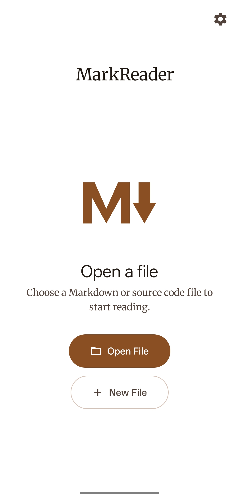
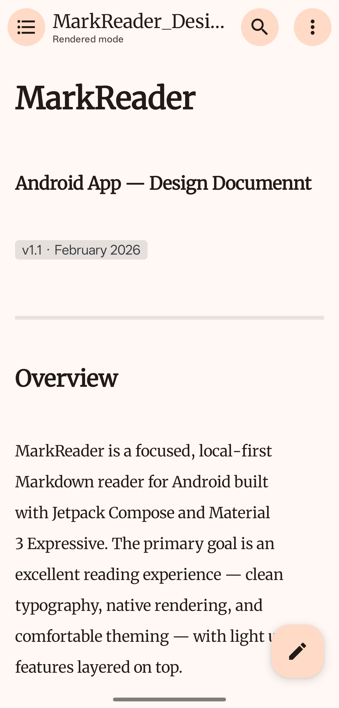
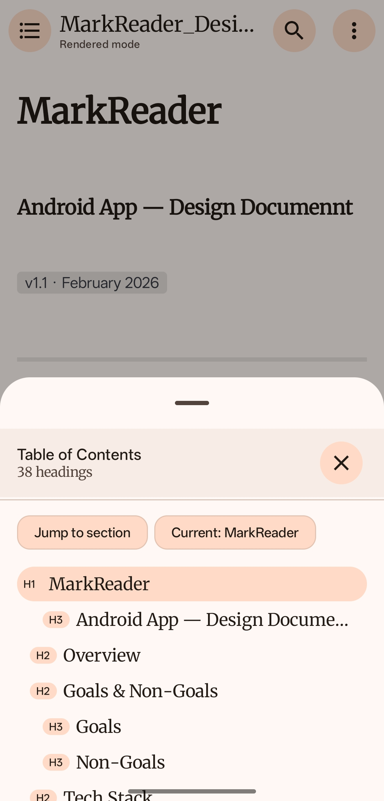
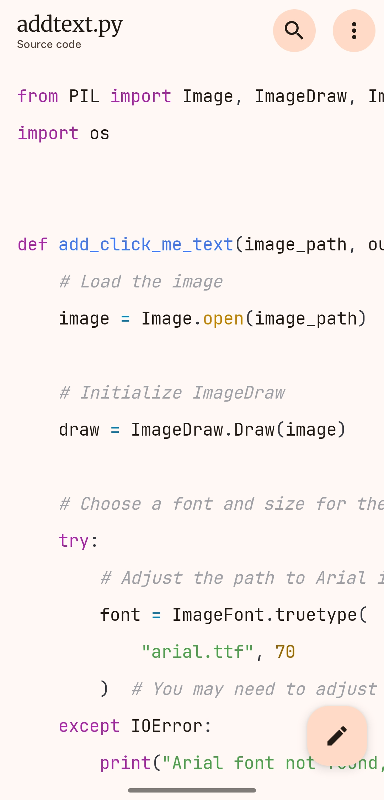
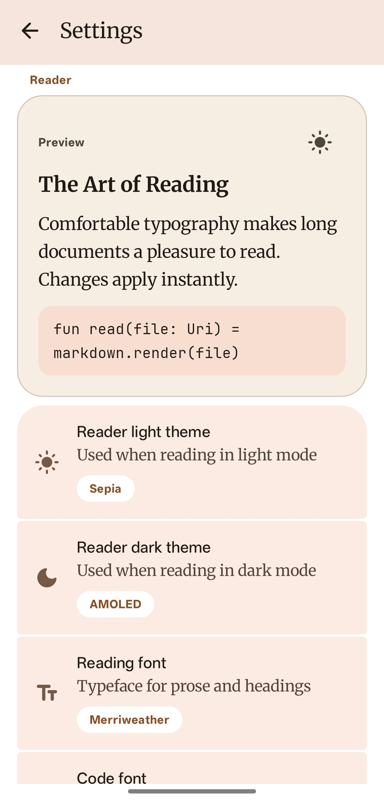
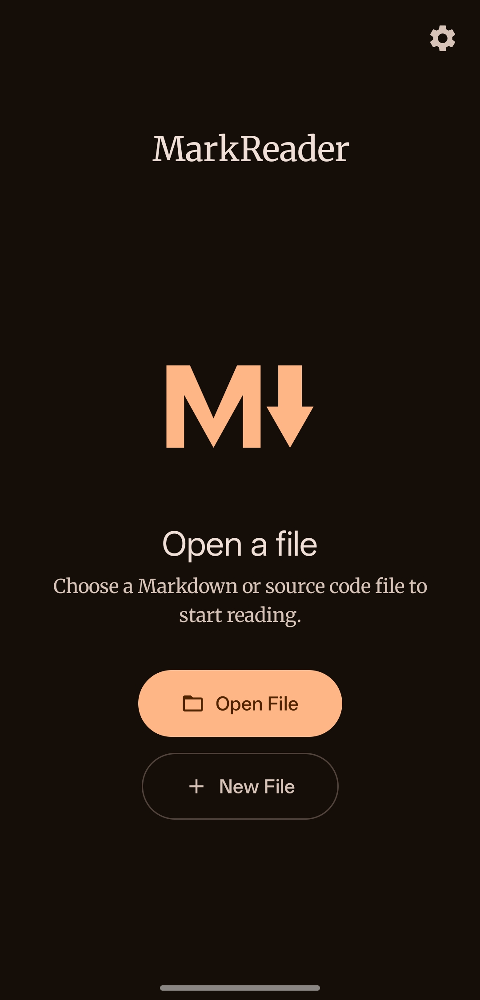

# MarkReader

<p align="center">
  <a href="https://github.com/usamaiqb/mark-reader/actions/workflows/ci.yml"></a>
  <a href="https://f-droid.org/packages/com.markreader/"></a>
  
  
  <a href="https://www.gnu.org/licenses/gpl-3.0"></a>
</p>

A lightweight, offline markdown and code file reader for Android with syntax highlighting and a built-in editor.

## Features

### Viewing
- 📄 **Markdown Rendering** - Full CommonMark support including headings, bold, italic, blockquotes, tables, and fenced code blocks
- 🎨 **Syntax Highlighting** - Code files highlighted for dozens of languages via Prism4j (Kotlin, Python, JavaScript, Java, C/C++, HTML, CSS, JSON, YAML, and more)
- 🌓 **Material You** - Dynamic color, dark and light themes, edge-to-edge display

### Editing
- ✏️ **Built-in Editor** - Edit markdown files with a live preview tab; edit code files with syntax-aware display
- 🔧 **Formatting Toolbar** - Quick access to bold, italic, headings, code blocks, links, and lists while editing
- 💾 **Save & Export** - Save edited files in place or export to a new location with Save As
- 🆕 **Create New Files** - Start a new markdown or code file from scratch

### App
- 📂 **Open from Anywhere** - Open files directly from any file manager via the standard share/open intent
- 🔒 **Privacy First** - No ads, no tracking, no analytics
- 📡 **Offline** - All processing happens locally on your device, no internet required

## Screenshots

<p align="center">
  
  
  
  
  
  
</p>

## Download

### F-Droid

[](https://f-droid.org/packages/com.markreader/)

### GitHub Releases

Download the latest APK from the [Releases](https://github.com/usamaiqb/mark-reader/releases) page.

## Requirements

- Android 7.0 (Nougat) or higher

## Permissions

MarkReader requires no special permissions. Files are opened through Android's standard content URI system — no storage permission needed.

## Building from Source

### Prerequisites

- Android Studio Meerkat (2024.3.1) or later
- JDK 17
- Android SDK with API level 35

### Build Steps

1. Clone the repository:
```bash
git clone https://github.com/usamaiqb/mark-reader.git
cd mark-reader
```

2. Open in Android Studio or build from command line:
```bash
./gradlew assembleRelease
```

3. The APK will be in `app/build/outputs/apk/release/`

## Privacy

MarkReader:
- ✅ Does NOT collect any personal data
- ✅ Does NOT require internet access
- ✅ Does NOT contain ads or tracking
- ✅ Does NOT share data with third parties
- ✅ All file processing happens locally on your device

For full details, see the [Privacy Policy](PRIVACY_POLICY.md).

## Contributing

Contributions are welcome! Please open an issue or pull request on [GitHub](https://github.com/usamaiqb/mark-reader).

## License

This project is licensed under the GNU General Public License v3.0 - see the [LICENSE](LICENSE) file for details.

## Support

- **Issues**: [GitHub Issues](https://github.com/usamaiqb/mark-reader/issues)

## Acknowledgments

Built with:
- [Kotlin](https://kotlinlang.org/) - Modern programming language for Android
- [Jetpack Compose](https://developer.android.com/jetpack/compose) - Modern Android UI toolkit
- [Material Design 3](https://m3.material.io/) - Modern design system
- [Markwon](https://github.com/noties/Markwon) - Markdown rendering for Android
- [Prism4j](https://github.com/noties/Prism4j) - Syntax highlighting
- [Merriweather](https://github.com/SorkinType/Merriweather) - Reading font (OFL)
- [JetBrains Mono](https://github.com/JetBrains/JetBrainsMono) - Code font (OFL)

## Changelog

See [CHANGELOG.md](CHANGELOG.md) for version history and changes.

---

Made with ❤️ for the open source community
